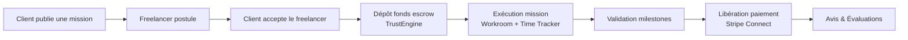
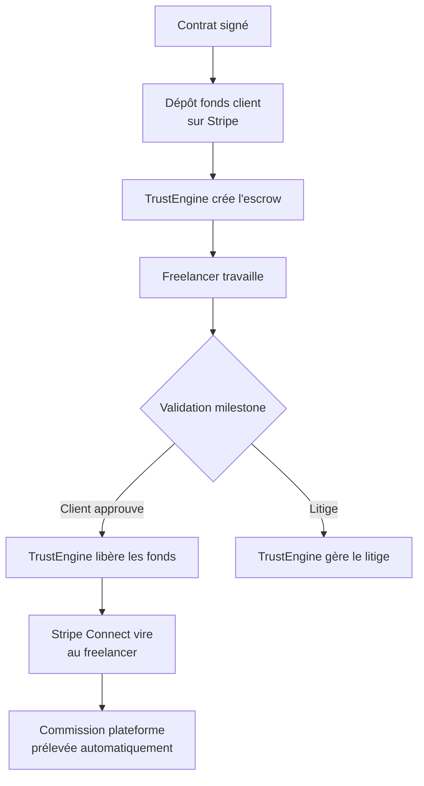

# 🏗️ Flexwork — Plan d'Implémentation Complet

> **Nature :** Plateforme de mise en relation Freelancers / Clients (type Malt/Upwork)
> **Stack :** Next.js 14 (App Router) — Tailwind CSS — Shadcn UI — Prisma/PostgreSQL — NextAuth.js — Stripe Connect — TrustEngine
> **Langue par défaut :** 🇫🇷 Français (multi-langue via `next-intl` prévu plus tard)

---

## 🎯 Core Flow (Stratégie gagnante)



---

## 🔍 3 Points de Risque Identifiés

| Risque | Niveau | Recommandation MVP |
|--------|--------|-------------------|
| 🔴 **Paiement Stripe Connect + TrustEngine** | Très élevé | S'appuyer à 100% sur les APIs — ne pas coder d'escrow custom |
| 🟡 **Recherche Elasticsearch/Algolia** | Élevé | Commencer par recherche PostgreSQL basique → migrer vers Algolia plus tard |
| 🟠 **IA "Uma Recruiter"** | Sous-spécifié | MVP = matching par embeddings (similarité cosinus). Pas d'agent complexe |

---

## 🌐 Stratégie i18n

| Aspect | Décision |
|--------|----------|
| **Librairie** | `next-intl` installé dès la Phase 1 |
| **Langue par défaut** | 🇫🇷 Français — pas de préfixe `/fr/` dans les URLs |
| **Fichier de traductions** | `messages/fr.json` (seul fichier au début) |
| **Ajout futur** | Créer `messages/en.json`, `messages/es.json` → les URLs deviendront automatiquement `/en/how-it-works` |
| **Code (variables/fonctions)** | 🇬🇧 Anglais (`createMission()`, `freelancerProfile`) |
| **Routes/URLs** | 🇫🇷 Français pour le SEO (`/comment-ca-marche`, `/missions`) |

---

## 🗺️ Plan d'Implémentation — 8 Phases

---

### Phase 1 — 🏗️ Fondations du Projet (4-5 jours)

**Objectif : Next.js 14, Design System, Data Model, Infrastructure**

#### 1.1 Initialisation du projet
```bash
npx create-next-app@14 . --typescript --tailwind --eslint --app
```

#### 1.2 Dépendances essentielles
```
📦 next-intl          → i18n (français par défaut)
📦 shadcn-ui          → Design system (npx shadcn-ui@latest init)
📦 prisma + @prisma/client → ORM PostgreSQL
📦 next-auth          → Authentification
📦 react-icons        → Icônes (Remix Icons)
📦 zod                → Validation formulaires
📦 react-hook-form + @hookform/resolvers → Formulaires
📦 vitest + @testing-library/react → Tests unitaires
```

#### 1.3 Structure des dossiers
```
app/
  (public)/               # Routes publiques - layout Header/Footer
  (dashboard)/            # Dashboard client & freelancer - layout Sidebar
  admin/                  # Panel admin
  api/                    # API routes (Next.js Route Handlers)
  [locale]/               # (futur) pour i18n multi-langue
components/
  ui/                     # Shadcn components
  elements/               # Composants réutilisables (HeroSection, Card, etc.)
  layout/                 # Header, Footer, Sidebar, Navbar
  forms/                  # Formulaires complexes
lib/
  prisma.ts               # Client Prisma singleton
  auth.ts                 # Configuration NextAuth
  utils.ts                # Fonctions utilitaires
  validations/            # Schémas Zod
messages/
  fr.json                 # 🔵 Fichier de traduction français (initial)
prisma/
  schema.prisma           # Data model
  seed.ts                 # Données de démo
```

#### 1.4 🗄️ Data Modeling (SCHÉMA PRISMA)

```prisma
model User {
  id              String    @id @default(cuid())
  email           String    @unique
  name            String?
  role            Role      @default(FREELANCER)  // CLIENT | FREELANCER | ADMIN
  stripeAccountId String?   // Stripe Connect
  trustEngineId   String?   // TrustEngine
  avatar          String?
  bio             String?
  skills          String[]  // Tags de compétences
  hourlyRate      Float?
  availability    String?   // "full-time", "part-time", "weekends"
  portfolio       String?   // URL portfolio
  createdAt       DateTime  @default(now())
  missions        Mission[]
  applications    Application[]
  payments        Payment[]
}

model Mission {
  id            String        @id @default(cuid())
  clientId      String
  client        User          @relation(fields: [clientId], references: [id])
  title         String
  description   String
  budget        Float
  currency      String        @default("EUR")
  skills        String[]
  duration      String?       // "1-3 mois", "6 mois+", etc.
  status        MissionStatus @default(DRAFT)  // DRAFT | OPEN | IN_PROGRESS | COMPLETED | CANCELLED
  applications  Application[]
  contract      Contract?
  createdAt     DateTime      @default(now())
  updatedAt     DateTime      @updatedAt
}

model Application {
  id          String        @id @default(cuid())
  freelancerId String
  freelancer  User          @relation(fields: [freelancerId], references: [id])
  missionId   String
  mission     Mission       @relation(fields: [missionId], references: [id])
  coverLetter String?
  proposedBudget Float?
  status      ApplicationStatus @default(PENDING) // PENDING | ACCEPTED | REJECTED | WITHDRAWN
  createdAt   DateTime      @default(now())
}

model Contract {
  id            String    @id @default(cuid())
  missionId     String    @unique
  mission       Mission   @relation(fields: [missionId], references: [id])
  freelancerId  String
  freelancer    User      @relation(fields: [freelancerId], references: [id])
  milestones    Milestone[]
  status        ContractStatus @default(PENDING)  // PENDING | ACTIVE | COMPLETED | DISPUTED
  escrowAmount  Float?
  escrowId      String?   // ID TrustEngine
  createdAt     DateTime  @default(now())
}

model Milestone {
  id          String      @id @default(cuid())
  contractId  String
  contract    Contract    @relation(fields: [contractId], references: [id])
  title       String
  description String?
  amount      Float
  status      MilestoneStatus @default(PENDING)  // PENDING | IN_REVIEW | APPROVED | RELEASED
  dueDate     DateTime?
  createdAt   DateTime    @default(now())
}

model Payment {
  id              String    @id @default(cuid())
  userId          String
  user            User      @relation(fields: [userId], references: [id])
  amount          Float
  currency        String    @default("EUR")
  stripePaymentId String?
  trustEngineId   String?
  type            PaymentType  // DEPOSIT | RELEASE | PAYOUT | REFUND
  status          PaymentStatus @default(PENDING)
  createdAt       DateTime  @default(now())
}

enum Role { CLIENT FREELANCER ADMIN }
enum MissionStatus { DRAFT OPEN IN_PROGRESS COMPLETED CANCELLED }
enum ApplicationStatus { PENDING ACCEPTED REJECTED WITHDRAWN }
enum ContractStatus { PENDING ACTIVE COMPLETED DISPUTED }
enum MilestoneStatus { PENDING IN_REVIEW APPROVED RELEASED }
enum PaymentType { DEPOSIT RELEASE PAYOUT REFUND }
enum PaymentStatus { PENDING SUCCEEDED FAILED REFUNDED }
```

#### 1.5 Layouts imbriqués (App Router)
- `app/(public)/layout.tsx` → Header/Footer publics + Hero
- `app/(dashboard)/layout.tsx` → Sidebar + Navigation contextuelle Client/Freelancer
- `app/admin/layout.tsx` → Panel admin sécurisé + stats

#### 1.6 Configuration i18n (next-intl)
- Fichier `messages/fr.json` avec toutes les clés UI
- Middleware Next.js pour la détection de locale
- Pas de préfixe dans l'URL tant qu'une seule langue

---

### Phase 2 — 🌐 Pages Publiques Statiques + Authentification (5-6 jours)
*Fusionnées car l'auth fait partie des 12 pages statiques*

#### 2.1 Les 12 pages statiques

| Route | Page | Type de rendu |
|-------|------|---------------|
| `/` | **Accueil** — Hero, Value Props, CTA, Témoignages | `static` (ISR) |
| `/comment-ca-marche` | **Comment ça marche** — Guide client/freelancer | `static` |
| `/tarifs` | **Tarifs** — Commissions plateforme | `static` |
| `/a-propos` | **À propos** — Équipe, mission, valeurs | `static` |
| `/contact` | **Contact** — Formulaire de contact | `static` |
| `/faq` | **FAQ** — Accordéon questions/réponses | `static` |
| `/cgu` | **Conditions Générales** | `static` |
| `/confidentialite` | **Politique de confidentialité** — RGPD | `static` |
| `/confiance` | **TrustEngine & Escrow** — Conditions | `static` |
| `/freelancers` | **Listing freelancers** — Grille + recherche basique | `static` + `generateStaticParams` |
| `/missions` | **Missions disponibles** — Liste des offres | `static` + revalidation |
| `/connexion` & `/inscription` | **Authentification** — Choix du rôle | `dynamic` |

#### 2.2 Composants réutilisables à créer
- `HeroSection` — Section héro avec CTA
- `ValuePropsGrid` — Grille de valeurs produit
- `PricingCard` — Carte de tarif
- `TestimonialCard` — Témoignage client
- `FaqAccordion` — Accordéon FAQ
- `FreelancerCard` — Carte profil freelancer
- `MissionCard` — Carte mission
- `ContactForm` — Formulaire de contact
- `AuthForm` — Formulaire login/register avec sélecteur de rôle

#### 2.3 Authentification
- NextAuth.js avec credentials (email/mdp) + OAuth (Google)
- Rôles : `CLIENT`, `FREELANCER`, `ADMIN` dans le JWT
- Middleware de protection des routes `/dashboard/*` et `/admin/*`
- Page `/inscription` avec onboarding rapide selon le rôle :
  - **Client** : nom d'entreprise, secteur
  - **Freelancer** : compétences, TJM, disponibilité

---

### Phase 3 — 🎯 Core Flow Client (5 jours)
*Objectif : Publier une mission → Trouver un freelancer*

#### 3.1 Tableau de bord client
| Route | Fonction |
|-------|----------|
| `/dashboard/client` | **Vue d'ensemble** — missions en cours, dépenses, statuts |
| `/dashboard/client/missions/creation` | **Création mission** — Formulaire step-by-step avec validation Zod |
| `/dashboard/client/missions/[id]` | **Détail mission** — Candidatures reçues, sélection freelancer |
| `/dashboard/client/recherche` | **Recherche freelancers** — Filtres : compétences, TJM, disponibilité |
| `/dashboard/client/freelancer/[id]` | **Profil freelancer** — Portfolio, avis, bouton "Inviter à la mission" |

#### 3.2 Composants techniques
- `MissionFormWizard` — Formulaire multi-étapes (Titre → Description → Budget → Compétences → Durée)
- `CandidatureList` — Liste des candidatures avec statut (PENDING / ACCEPTED / REJECTED)
- `FreelancerSearch` — Barre de recherche + filtres
- `InviteButton` — Bouton d'invitation directe

#### 3.3 API Routes nécessaires
| Route API | Méthode | Action |
|-----------|---------|--------|
| `/api/missions` | GET / POST | Lister / Créer une mission |
| `/api/missions/[id]` | GET / PUT / DELETE | Détail / Modifier / Supprimer |
| `/api/applications` | GET | Voir les candidatures |
| `/api/applications/[id]` | PUT | Accepter / Refuser une candidature |
| `/api/users/freelancers` | GET | Rechercher des freelancers |

---

### Phase 4 — 💼 Core Flow Freelancer (5 jours)
*Objectif : Trouver une mission → Postuler → Exécuter*

#### 4.1 Tableau de bord freelancer
| Route | Fonction |
|-------|----------|
| `/dashboard/freelancer` | **Vue d'ensemble** — Revenus, missions en cours, suggestions "Uma" |
| `/dashboard/freelancer/profil` | **Édition profil** — Compétences, TJM, portfolio, disponibilité |
| `/dashboard/freelancer/recherche` | **Recherche missions** — Filtres, matching |
| `/dashboard/freelancer/missions/[id]` | **Candidature** — Cover letter, proposition budget |
| `/dashboard/freelancer/contrat/[id]` | **Workroom** — Espace de travail partagé Client/Freelancer |
| `/dashboard/freelancer/paiements` | **Encaissements** — Solde, historique virements |

#### 4.2 Composants techniques
- `WorkRoom` — Espace de travail partagé (Client + Freelancer)
  - `MessageList` — Chat intégré temps réel
  - `VideoCallLink` — Composant lien Zoom/Meet (remplace WebRTC)
  - `MilestoneList` — Validation des jalons de paiement
- `TimeTracker` — Composant `"use client"` avec `setInterval`
  - Boutons Start / Stop / Pause
  - Comptage des heures
  - Capture d'écran périodique **optionnelle** (nécessite permission utilisateur)
- `FileUploader` — Upload de livrables

#### 4.3 API Routes
| Route API | Méthode | Action |
|-----------|---------|--------|
| `/api/applications` | POST | Postuler à une mission |
| `/api/contracts` | GET / POST | Lister / Créer un contrat |
| `/api/contracts/[id]/milestones` | GET / POST / PUT | Gérer les milestones |
| `/api/time-tracker/[contractId]` | POST | Enregistrer session de travail |
| `/api/messages` | GET / POST | Chat (polling ou Socket.io) |
| `/api/upload` | POST | Upload fichier livrable |

---

### Phase 5 — 💳 Paiement Stripe Connect + TrustEngine (7-10 jours)
⚠️ **Partie la plus risquée — À démarrer dès la Phase 3 en parallèle**

#### 5.1 🔄 Diagramme de flux — Clarification des responsabilités



| Qui fait quoi ? | Stripe Connect | TrustEngine |
|----------------|---------------|-------------|
| **Onboarding / KYC** du freelancer | ✅ Compte Connect + vérification | ❌ (Stripe suffit) |
| **Paiement carte client** | ✅ `PaymentIntent` | ❌ |
| **Escrow / Séquestre** | ❌ | ✅ Gestion des fonds bloqués |
| **Milestones / Jalons** | ❌ | ✅ Validation et libération |
| **Virement au freelancer** | ✅ `Transfer` vers compte Connect | ❌ |
| **Commission plateforme** | ✅ `ApplicationFee` automatique | ❌ |
| **Litiges / Disputes** | ❌ | ✅ Gestion des conflits |
| **Webhooks** | ✅ `checkout.session.completed`, `payout.paid` | ✅ Événements escrow |

> **Décision :** TrustEngine pour l'escrow uniquement. Le KYC freelancer et les virements sont gérés **uniquement par Stripe Connect** pour éviter la duplication.

#### 5.2 Routes à implémenter

| Route | Fonction |
|-------|----------|
| `/dashboard/client/paiements` | **Historique** — Factures, reçus |
| `/dashboard/client/paiements/escrow` | **Dépôt fonds** — Déposer en séquestre via TrustEngine |
| `/dashboard/freelancer/paiements` | **Encaissements** — Solde, historique des virements |
| `/dashboard/freelancer/onboarding` | **Onboarding Stripe** — Redirection Stripe pour KYC |

#### 5.3 Webhooks
- `/api/webhooks/stripe` → Écouter `checkout.session.completed`, `account.updated`, `payout.paid`
- `/api/webhooks/trustengine` → Écouter `escrow.created`, `milestone.released`, `dispute.opened`
- **Sécurité** : Vérifier les signatures des webhooks (HMAC)

---

### Phase 6 — 🤖 IA "Uma Recruiter" — Version MVP (3-4 jours)

#### 6.1 Matching intelligent (pas un simple keyword)
Au lieu d'un bête matching par mots-clés:
1. **Générer des embeddings** des descriptions de missions et profils freelancers (OpenAI API)
2. **Stocker les vecteurs** directement en PostgreSQL (avec `pgvector` extension)
3. **Similarité cosinus** pour les recommandations : plus une mission ressemble sémantiquement au profil, plus le score est élevé
4. **Système de score pondéré** : `score = (poids_compétences × matching_keywords) + (poids_sémantique × similarité_cosinus) + (poids_taux × compatibilité_budget)`

#### 6.2 Fonctionnalités MVP
- **Côté Client** : Suggestions de freelancers quand une mission est publiée
- **Côté Freelancer** : Suggestions de missions sur le dashboard ("Uma vous recommande")
- **Admin** : Dashboard de configuration des poids de matching

#### 6.3 API Routes
| Route API | Méthode | Action |
|-----------|---------|--------|
| `/api/uma/recommandations/freelancers` | GET | Recommandations pour une mission |
| `/api/uma/recommandations/missions` | GET | Recommandations pour un freelancer |
| `/api/uma/embeddings` | POST | Générer/mettre à jour les embeddings |

---

### Phase 7 — 🛠️ Panel Admin + Tests (5 jours)

#### 7.1 Panel Admin
| Route | Fonction |
|-------|----------|
| `/admin` | **Dashboard** — GMV, utilisateurs actifs, KPIs |
| `/admin/utilisateurs` | **Gestion** — Validation KYC, bannissement, rôles |
| `/admin/missions` | **Modération** — Valider les offres, résoudre litiges |
| `/admin/paiements` | **Suivi financier** — Transactions Stripe, fonds escrow |
| `/admin/uma-recruiter` | **Config IA** — Poids de matching, logs, feedback |

#### 7.2 🧪 Plan de tests

| Type | Technologie | Priorité | Ce qu'on teste |
|------|------------|----------|---------------|
| **Unitaires** | Vitest | 🔴 P1 | Composants, hooks, utilitaires, validations Zod |
| **API/Intégration** | Vitest + Supertest | 🔴 P1 | Routes API Stripe/TrustEngine, webhooks |
| **E2E Core Flow** | Playwright | 🟡 P2 | Parcours complet : inscription → mission → candidature → paiement |
| **Sécurité** | Manual + OWASP ZAP | 🟡 P2 | CSRF, rate limiting, injections |

---

### Phase 8 — 🔒 Sécurité + Performance + Polish (3 jours)

#### 8.1 Sécurité
| Action | Détail |
|--------|--------|
| Rate limiting | Middleware ou Upstash Ratelimit sur `/api/payments/*` et `/api/auth/*` |
| Validation | Zod côté API + côté client |
| Webhooks | Vérification des signatures Stripe (HMAC SHA-256) |
| Fichiers uploadés | Validation MIME + limite 10MB + suppression auto |
| Données sensibles | Jamais de `client_secret` ou `api_key` exposé côté client |

#### 8.2 Performance
| Type de page | Stratégie de rendu |
|-------------|-------------------|
| Pages statiques (CGU, FAQ, À propos...) | `static` (ISR avec revalidation 24h) |
| `/freelancers`, `/missions` | `static` + `revalidate: 300` |
| Dashboards | `dynamic` (données privées par utilisateur) |
| Profils freelancers | `static` + `generateStaticParams` |
| Workroom / Contrat | `dynamic` (temps réel, chat) |
| Images | `next/image` avec WebP + lazy loading |

#### 8.3 Polish
- Messages de toast (Succès / Erreur) via Sonner ou Shadcn Toast
- États de loading (skeleton) pour tous les chargements
- États vides (empty states) pour les listes sans données
- Gestion des erreurs 404, 500 pages custom
- Responsive mobile-first sur toutes les vues

---

## 📊 Calendrier Récapitulatif

```mermaid
gantt
    title Planning Flexwork — 8 semaines
    dateFormat  YYYY-MM-DD
    axisFormat  %d/%m
    
    section Fondations
    Phase 1 : Init + Data Model + Design System     :a1, 7j
    
    section Pages + Auth
    Phase 2 : 12 pages statiques + Authentification :a2, after a1, 6j
    
    section Core Flow
    Phase 3 : Client (publier, chercher)            :a3, after a2, 5j
    Phase 4 : Freelancer (postuler, workroom)        :a4, after a2, 5j
    
    section Paiement (⚠️ parallèle)
    Phase 5 : Stripe Connect + TrustEngine           :a5, after a2, 10j
    
    section IA + Admin + Polish
    Phase 6 : IA "Uma" MVP                           :a6, after a4, 4j
    Phase 7 : Admin + Tests                          :a7, after a5, 5j
    Phase 8 : Sécurité + Perf + Polish               :a8, after a7, 3j
```

---

## 🚀 Démarrage Immédiat

```bash
# 1. Créer le projet Next.js
npx create-next-app@14 . --typescript --tailwind --eslint --app

# 2. Installer les dépendances clés
npm install next-intl prisma @prisma/client next-auth react-icons zod react-hook-form @hookform/resolvers
npm install -D vitest @testing-library/react @vitejs/plugin-react

# 3. Initialiser Shadcn UI
npx shadcn-ui@latest init

# 4. Initialiser Prisma
npx prisma init

# 5. Créer le fichier de traduction français
mkdir messages
```

**Prêt à commencer par la Phase 1 ? 🚀**

